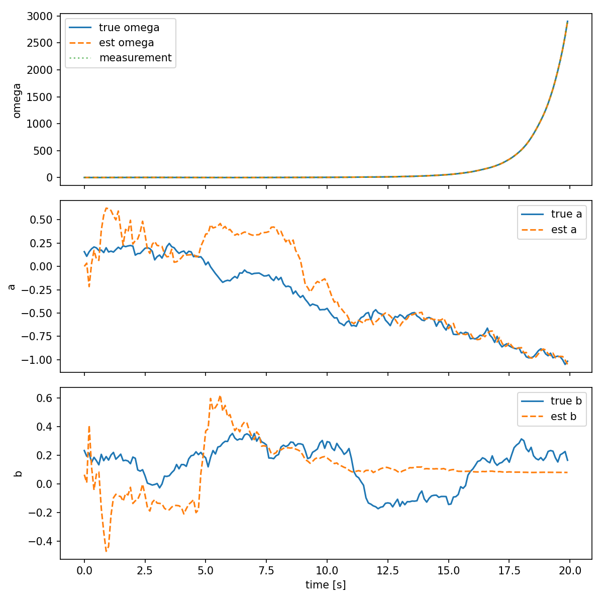

Extended Kalman Filter
======================

Review (Kalman filter) on covariance prediction and correction
--------------------------------------------------------------

For a nonlinear dynamic system:

.. math::

    \begin{aligned}
    x_{k} &= f\bigl(x_{k-1},\,u_{k-1}\bigr) \quad\text{(nonlinear state transition)}\\
    y_{k} &= g\bigl(x_{k},\,u_{k}\bigr) \quad\text{(nonlinear measurement)}
    \end{aligned}

- Time update (prediction):

.. math::

    P_{k|k-1} = A_{k}\,P_{k-1|k-1}\,A_{k}^{T} + Q_{d}

Note: A constant linear matrix :math:`A` does not exist for nonlinear systems; instead we linearize about the current estimate and use a time-varying Jacobian :math:`A_{k}`.

- Measurement (correction):

.. math::

    P_{k|k} = \bigl(I - K_{k}\,C_{k}\bigr)\,P_{k|k-1}

The key step in the Extended Kalman Filter (EKF) is computing the Jacobians :math:`A_{k}` and :math:`C_{k}` (the linearizations of :math:`f` and :math:`g` about the current estimate):

.. math::

    A_{k} = \left.\frac{\partial f}{\partial x}\right|_{x=\hat{x}_{k-1|k-1}}, \qquad
    C_{k} = \left.\frac{\partial g}{\partial x}\right|_{x=\hat{x}_{k|k-1}}

The Jacobian :math:`A_{k}` can be written elementwise as

.. math::

    A_{k} =
    \begin{bmatrix}
    \frac{\partial f_{1}}{\partial x_{1}} & \cdots & \frac{\partial f_{1}}{\partial x_{n}} \\
    \vdots & \ddots & \vdots \\
    \frac{\partial f_{n}}{\partial x_{1}} & \cdots & \frac{\partial f_{n}}{\partial x_{n}}
    \end{bmatrix}_{x=\hat{x}_{k-1|k-1}}

and similarly for :math:`C_{k}` using partial derivatives of :math:`g`.

and similarly for :math:`C_{k}` using partial derivatives of :math:`g` (measurements :math:`y\in\mathbb{R}^{m}`):

.. math::

    C_{k} =
    \begin{bmatrix}
    \frac{\partial g_{1}}{\partial x_{1}} & \cdots & \frac{\partial g_{1}}{\partial x_{n}} \\
    \vdots & \ddots & \vdots \\
    \frac{\partial g_{m}}{\partial x_{1}} & \cdots & \frac{\partial g_{m}}{\partial x_{n}}
    \end{bmatrix}_{x=\hat{x}_{k|k-1}}

For differential equations (continuous → discrete):
 
 .. math::
 
     \dot{x} = f(x, u) \quad\Rightarrow\quad x_{k} \approx x_{k-1} + T_{s}\,f\bigl(x_{k-1},\,u_{k-1}\bigr)
 
 The discrete-time Jacobian (linearized about the estimate) is:
 
 .. math::
 
     A_{k-1} = I + T_{s}\left.\frac{\partial f}{\partial x}\right|_{x=\hat{x}_{k-1|k-1}}
 
 The estimated state vector (column form) is written as:
 
 .. math::
 
     \hat{x}_{k|k} =
     \begin{bmatrix}
     \hat{x}_{1} \\
     \hat{x}_{2} \\
     \vdots \\
     \hat{x}_{n}
     \end{bmatrix}
     
Example
^^^^^^^

.. math::

    \dot{\omega} = -a\,\omega + 1.5\,\sin(t) + b + \sqrt{0.1}\,v(t)

Let

.. math::

    x_{1} = \omega, \quad x_{2} = a, \quad x_{3} = b

Then the continuous-time dynamics for the state components are

.. math::

    \dot{x}_{1} &= -x_{2}\,x_{1} + 1.5\,\sin(t) + x_{3} + \sqrt{0.1}\,v_{1}(t)\\
    \dot{x}_{2} &= 0 + \sqrt{0.01}\,v_{2}(t)\\
    \dot{x}_{3} &= 0 + \sqrt{0.01}\,v_{3}(t)

or in compact form

.. math::

    \dot{x} = f(x,t) + \sqrt{Q_{c}}\,v(t)

with

.. math::

    f(x,t) = \begin{bmatrix}
               -x_{2}\,x_{1} + 1.5\,\sin(t) + x_{3} \\
               0 \\
               0 
              \end{bmatrix}

and the process-noise term

.. math::

    \sqrt{Q_{c}}\,v(t) =
    \begin{bmatrix}
      \sqrt{0.1} & 0 & 0 \\
      0 & \sqrt{0.01} & 0 \\
      0 & 0 & \sqrt{0.01}
    \end{bmatrix}
    \begin{bmatrix} v_{1}(t) \\ v_{2}(t) \\ v_{3}(t) \end{bmatrix}

The continuous-time Jacobian:

.. math::

    A_c = \partial f/\partial x = \begin{bmatrix}
            -x_{2} & -x_{1} & 1 \\
            0 & 0 & 0 \\
            0 & 0 & 0 
            \end{bmatrix}

The discretized linearization (Euler, sample time :math:`T_{s}`) is

.. math::

    A_{k-1} = I_{3} + T_{s}\,A_{c}\bigl|_{x=\hat{x}_{k-1|k-1}}

If we measure only the angular rate :math:`\omega`, the measurement model is

.. math::

    y = \omega = x_{1} = \begin{bmatrix} 1 & 0 & 0 \end{bmatrix}\,x

.. code-block:: matlab

    % ekf_example.m
    % Extended Kalman Filter example (3-state) using Euler discretization
    function ekf_example()
        Ts = 0.1;
        N = 200;
        t = 0:Ts:Ts*(N-1);

        % true initial state
        x_true = [0.5; 0.1; 0.2];
        % initial estimate
        x = [0;0;0];
        P = diag([0.5,0.5,0.5]);

        Qc = diag([0.1, 0.01, 0.01]);
        R = 0.05;

        rng('default');

        for k = 1:N
            tk = t(k);
            % simulate true system (Euler)
            w = mvnrnd([0 0 0], Qc)';
            x_true = x_true + Ts * f_cont(x_true, tk) + sqrt(Ts)*w;

            % measurement
            v = sqrt(R)*randn();
            y = x_true(1) + v;

            % predict
            [x_pred, P_pred] = ekf_predict_matlab(x, P, Ts, Qc, tk);

            % update
            [x, P] = ekf_update_matlab(x_pred, P_pred, y, R);
        end

        disp('Final true state:'); disp(x_true');
        disp('Final estimate:'); disp(x');
    end

    % Plot results
    figure;
    tt = 0:Ts:Ts*(N-1);
    subplot(3,1,1);
    plot(tt, true_states(1,:),'b-', tt, est_states(1,:),'r--');
    legend('true omega','est omega'); ylabel('omega');
    subplot(3,1,2);
    plot(tt, true_states(2,:),'b-', tt, est_states(2,:),'r--');
    legend('true a','est a'); ylabel('a');
    subplot(3,1,3);
    plot(tt, true_states(3,:),'b-', tt, est_states(3,:),'r--');
    legend('true b','est b'); ylabel('b'); xlabel('time (s)');

    function dx = f_cont(x, t)
        omega = x(1); a = x(2); b = x(3);
        dx = [-a*omega + 1.5*sin(t) + b; 0; 0];
    end

    function A = A_cont(x, t)
        omega = x(1); a = x(2);
        A = [-a, -omega, 1; 0,0,0; 0,0,0];
    end

    function [x_pred, P_pred] = ekf_predict_matlab(x, P, Ts, Qc, t)
        x_pred = x + Ts * f_cont(x, t);
        A = eye(3) + Ts * A_cont(x, t);
        P_pred = A * P * A' + Ts * Qc;
    end

    function [x_upd, P_upd] = ekf_update_matlab(x_pred, P_pred, y, R)
        C = [1 0 0];
        S = C * P_pred * C' + R;
        K = (P_pred * C') / S;
        x_upd = x_pred + K * (y - C * x_pred);
        P_upd = (eye(3) - K * C) * P_pred;
    end

.. code-block:: Python

    import numpy as np

    def f(x, t):
        # continuous dynamics converted to discrete via Euler (sample time applied outside)
        # x = [omega, a, b]
        omega, a, b = x
        dx1 = -a * omega + 1.5 * np.sin(t) + b
        dx2 = 0.0
        dx3 = 0.0
        return np.array([dx1, dx2, dx3])

    def g(x):
        # measurement: y = omega
        return np.array([x[0]])

    def A_continuous(x, t):
        # Jacobian of f wrt x (continuous-time)
        omega, a, b = x
        return np.array([[-a, -omega, 1.0],
                        [0.0, 0.0, 0.0],
                        [0.0, 0.0, 0.0]])

    def C_jacobian(x):
        # Jacobian of g wrt x
        return np.array([[1.0, 0.0, 0.0]])

    def ekf_predict(x, P, Ts, Qc, t):
        # discrete-time predict using Euler discretization
        # x_{k} = x_{k-1} + Ts * f(x_{k-1}, t)
        x_pred = x + Ts * f(x, t)
        A = np.eye(3) + Ts * A_continuous(x, t)
        P_pred = A @ P @ A.T + Ts * Qc
        return x_pred, P_pred

    def ekf_update(x_pred, P_pred, y, R):
        C = C_jacobian(x_pred)
        S = C @ P_pred @ C.T + R
        K = P_pred @ C.T @ np.linalg.inv(S)
        x_upd = x_pred + (K @ (y - g(x_pred))).reshape(-1)
        P_upd = (np.eye(len(x_pred)) - K @ C) @ P_pred
        return x_upd, P_upd

    def simulate_and_run(Ts=0.1, N=200):
        t = 0.0
        # true initial state
        x_true = np.array([0.5, 0.1, 0.2])
        # initial estimate
        x = np.array([0.0, 0.0, 0.0])
        P = np.diag([0.5, 0.5, 0.5])

        # continuous process noise covariance (Qc) and measurement noise (R)
        Qc = np.diag([0.1, 0.01, 0.01])
        R = np.array([[0.05]])

        history = []

        for k in range(N):
            # simulate true system (Euler discrete approx)
            w = np.random.multivariate_normal(np.zeros(3), Qc) * np.sqrt(Ts)
            x_true = x_true + Ts * f(x_true, t) + w

            # measurement
            v = np.random.normal(0, np.sqrt(R[0,0]))
            y = np.array([x_true[0] + v])

            # EKF predict
            x_pred, P_pred = ekf_predict(x, P, Ts, Qc, t)

            # EKF update
            x, P = ekf_update(x_pred, P_pred, y, R)

            history.append((t, x_true.copy(), x.copy(), P.copy(), y.copy()))
            t += Ts

        return history

    if __name__ == '__main__':
        hist = simulate_and_run()
        # print final results
        t, x_true, x_est, P, y = hist[-1]
        print('Final time: {:.2f}s'.format(t))
        print('True state: ', x_true)
        print('Estimated:  ', x_est)
        print('Measurement: ', y)

        # Prepare and save plots
        try:
            import matplotlib
            matplotlib.use('Agg')
            import matplotlib.pyplot as plt

            times = np.array([h[0] for h in hist])
            true_vals = np.vstack([h[1] for h in hist])
            est_vals = np.vstack([h[2] for h in hist])
            meas = np.hstack([h[4][0] for h in hist])

            fig, ax = plt.subplots(3, 1, figsize=(8, 8), sharex=True)
            ax[0].plot(times, true_vals[:,0], label='true omega')
            ax[0].plot(times, est_vals[:,0], label='est omega', linestyle='--')
            ax[0].plot(times, meas, label='measurement', linestyle=':', alpha=0.6)
            ax[0].legend()
            ax[0].set_ylabel('omega')

            ax[1].plot(times, true_vals[:,1], label='true a')
            ax[1].plot(times, est_vals[:,1], label='est a', linestyle='--')
            ax[1].legend()
            ax[1].set_ylabel('a')

            ax[2].plot(times, true_vals[:,2], label='true b')
            ax[2].plot(times, est_vals[:,2], label='est b', linestyle='--')
            ax[2].legend()
            ax[2].set_ylabel('b')
            ax[2].set_xlabel('time [s]')

            plt.tight_layout()
            out_path = 'ekf_plot.png'
            fig.savefig(out_path, dpi=150)
            print(f'Plot saved to {out_path}')
        except Exception as e:
            print('Plotting failed:', e)

