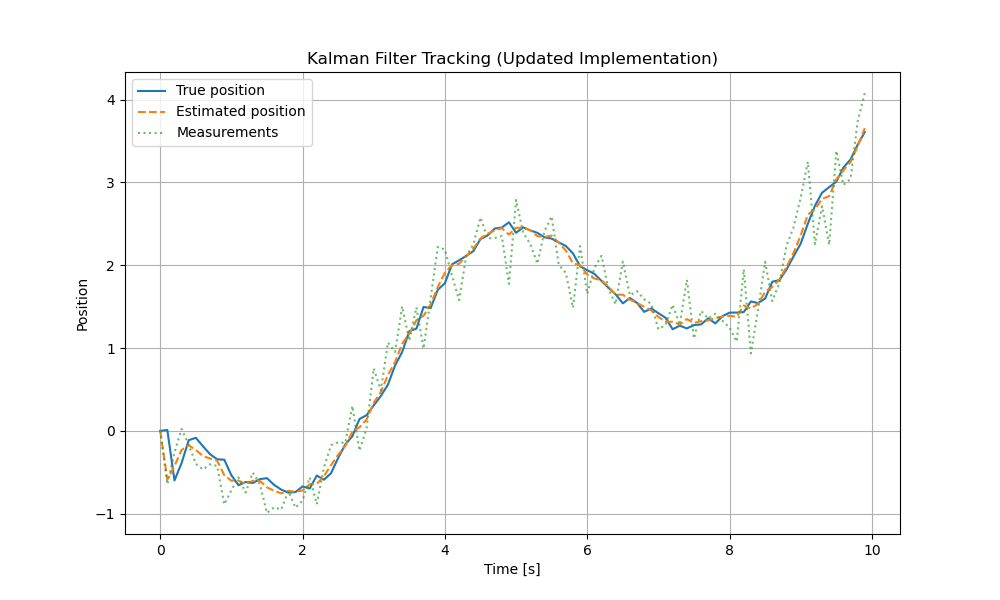

Kalman Filter Implementation
============================

With continuouse state-space model state-space equation:

.. math::

    \dot{x} = Ax + Bu + \sqrt{Q_{C}} v(t)\\
    y = Cx + \sqrt{R} w(t) 

Discretization the model into: 

.. math::

   x_{k} = x_{k-1} + T_s (A x_{k-1} + B u_{k-1}) + \sqrt{Q_c T_s}\, v_{k-1} \\
   y_k = C x_k

.. code-block:: matlab

    c = [1, 0]

    function x_dot = condyn(x, u, A, B)
        x_dot = A * x + B * u
    end

    function x_k = disdyn(x, u, A, B, T_s, Q_c)
        n = length(x);
        x_k = x + T_s * condyn(x, u, A, B) + \sqrt(Q_c * T_s) * random(n, 1)
    end

    function y = measure(x, c)
        y = c * x 
    end 

.. note::

    condyn = continuous dynamic

    disdyn = discrete dynamic

    A = transition matrix of continuous state

    B = input matrix of continuous state

.. code-block:: matlab

    for k = 2:N_sample
        % true state anf measurement
        u = sin(t(k - 1));
        [xk, ~] = disdyn(x_est_store(:, k - 1), u, A, B, T_s);
        x_store(:, k) = xk + sqrt(Q_c * T_s) * randn(2, 1);
        y_store(1, k) = measure(x_store(:, k), c) + sqrt(R) * randn(1, 1);

        % kalman filter
        % next state prediction and error covariance update
        [xk, Ak] = disdyn(x_est_store(:, k - 1), u, A, B, T_s);
        x_est_store(:, k) = xk; 
        p = Ak * p * Ak' + Q_d;

        % estimate measurement, cross covariance, auto covariance, kalman gain
        y_est = measure(x_est_store(:, k), c);
        p_xy = p * c;
        p_yy = c * p * c' + r; % innovation covariance
        k = p_xy/p_yyy; % kalman gain
        x_est_store(:, k) = x_est_store(:, k) + k *y_store(1, k) - y_est); % update estimate
        p = (eye(2) - k * c) + p; update error covariance
    end 

Python implementation
---------------------

.. code-block:: Python

    import numpy as np
    import matplotlib.pyplot as plt

    # -----------------------------
    # Parameters
    # -----------------------------
    Ts = 0.1           # sampling time
    N_sample = 100     # number of samples

    A = np.array([[0, 1],
                [0, 0]])  # continuous-time A
    B = np.array([[0],
                [1]])     # continuous-time B
    c = np.array([[1, 0]])  # measurement matrix

    Q_c = np.array([[0.01, 0],
                    [0, 0.01]])  # continuous process noise
    R = 0.1  # measurement noise

    Q_d = Q_c * Ts  # discrete process noise

    # -----------------------------
    # Storage initialization
    # -----------------------------
    x_store = np.zeros((2, N_sample))
    y_store = np.zeros(N_sample)
    x_est_store = np.zeros((2, N_sample))
    p = np.eye(2)  # initial error covariance

    x_store[:, 0] = [0, 0]
    x_est_store[:, 0] = [0, 0]

    t = np.arange(N_sample) * Ts

    # -----------------------------
    # Functions
    # -----------------------------
    def condyn(x, u, A, B):
        """Continuous dynamics"""
        return A @ x + B.flatten() * u

    def disdyn(x, u, A, B, Ts):
        """Discrete dynamics and linearized Ak"""
        xk = x + Ts * condyn(x, u, A, B)
        Ak = np.eye(len(x)) + Ts * A  # linearized discrete-time transition
        return xk, Ak

    def measure(x, c):
        """Measurement function"""
        return c @ x

    # -----------------------------
    # Simulation loop
    # -----------------------------
    for k in range(1, N_sample):
        u = np.sin(t[k-1])
        
        # True system + measurement noise
        xk, _ = disdyn(x_est_store[:, k-1], u, A, B, Ts)
        x_store[:, k] = xk + np.random.multivariate_normal([0,0], Q_c*Ts)
        y_store[k] = measure(x_store[:, k], c) + np.random.normal(0, np.sqrt(R))
        
        # Kalman filter prediction
        xk_pred, Ak = disdyn(x_est_store[:, k-1], u, A, B, Ts)
        x_est_store[:, k] = xk_pred
        p = Ak @ p @ Ak.T + Q_d
        
        # Measurement update
        y_pred = measure(x_est_store[:, k], c)
        p_xy = p @ c.T
        p_yy = c @ p @ c.T + R
        K = p_xy / p_yy  # Kalman gain
        x_est_store[:, k] = x_est_store[:, k] + K.flatten() * (y_store[k] - y_pred)
        p = (np.eye(2) - K @ c) @ p

    # -----------------------------
    # Plot results
    # -----------------------------
    plt.figure(figsize=(10,6))
    plt.plot(t, x_store[0, :], label='True position')
    plt.plot(t, x_est_store[0, :], label='Estimated position', linestyle='--')
    plt.plot(t, y_store, label='Measurements', linestyle=':', alpha=0.7)
    plt.xlabel('Time [s]')
    plt.ylabel('Position')
    plt.title('Kalman Filter Tracking (Updated Implementation)')
    plt.legend()
    plt.grid(True)
    plt.show()

   Kalman filter simulation results: true state, measurements, and estimated state.
    